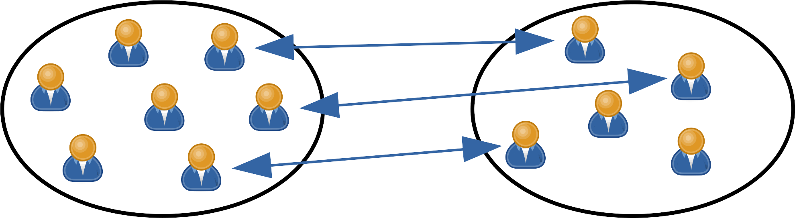
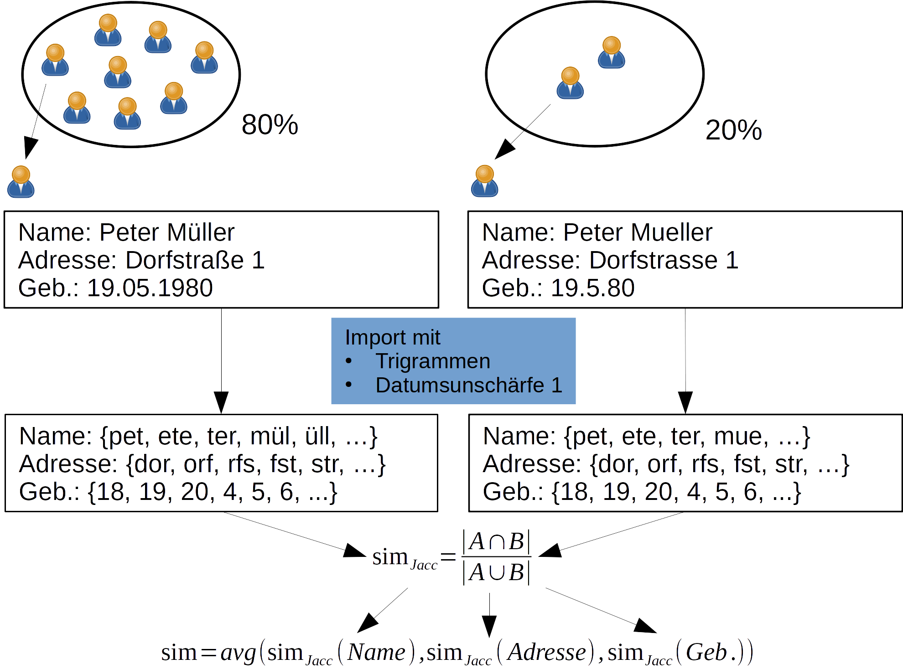
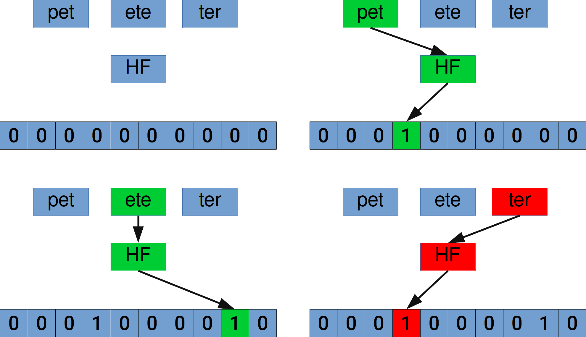
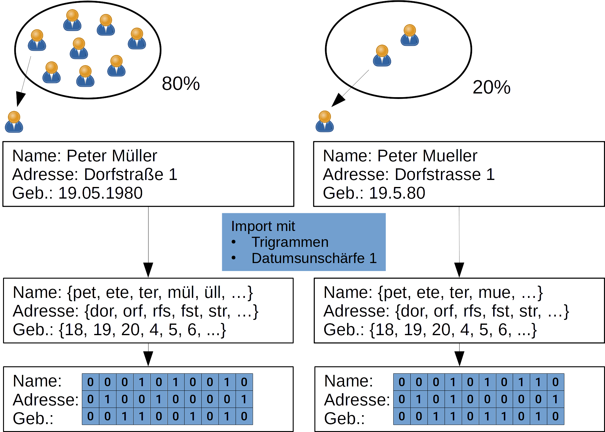
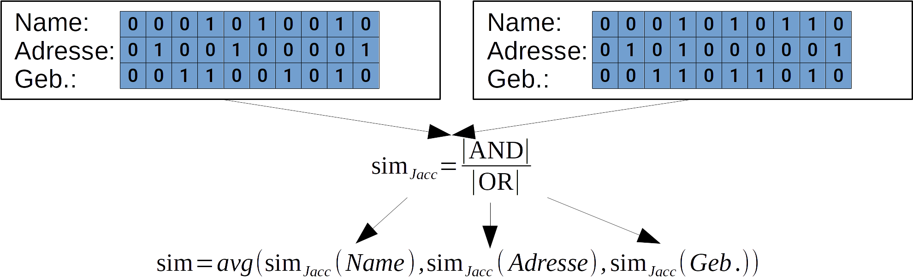

## Problem

- 2 Mengen von Personen
- repräsentiert durch Id, Name, Adresse und Geburtsdatum
- finden gleicher Personen in beiden Datensätzen
- Standardansatz: Entity Resolution mit Jaccard-Koeffizient
- Optimierung mittels Bitarrays (Bloomfilter)

## Entity Resolution mit Jaccard-Koeffizient

## Bloomfilter

## Anwendung Bloomfilter 1

## Anwendung Bloomfilter

